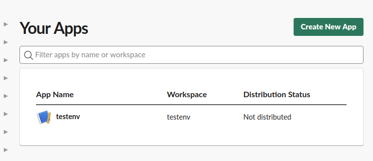
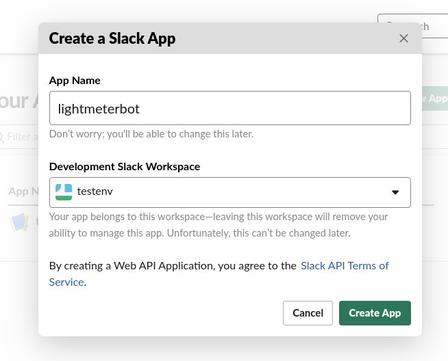
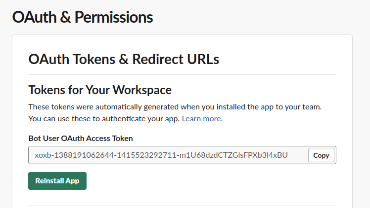
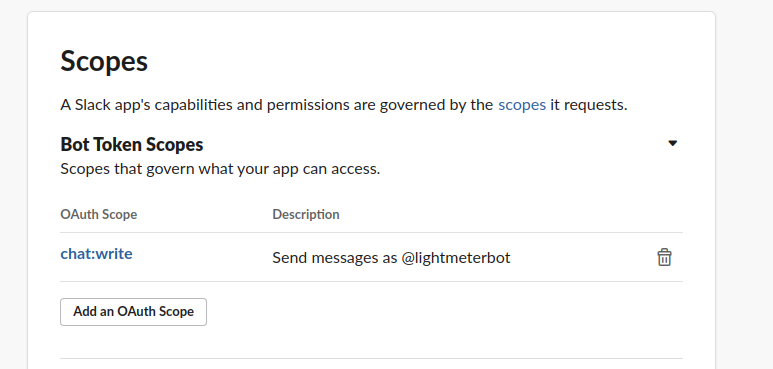

# Lightmeter ControlCenter (Alpha)

[](https://gitlab.com/lightmeter/controlcenter/-/commits/master)
[](http://translate.lightmeter.io/engage/controlcenter/?utm_source=widget)
<br/>
[](https://goreportcard.com/report/gitlab.com/lightmeter/controlcenter)
[](https://sonarcloud.io/dashboard?id=lightmeter_controlcenter)
[](https://gitlab.com/lightmeter/controlcenter/-/commits/master)
[](https://sonarcloud.io/dashboard?id=lightmeter_controlcenter)
<br/>
[](https://sonarcloud.io/dashboard?id=lightmeter_controlcenter)
[](https://sonarcloud.io/dashboard?id=lightmeter_controlcenter)
[](https://sonarcloud.io/dashboard?id=lightmeter_controlcenter)
[](https://sonarcloud.io/dashboard?id=lightmeter_controlcenter)
[](https://sonarcloud.io/dashboard?id=lightmeter_controlcenter)
[](https://sonarcloud.io/dashboard?id=lightmeter_controlcenter)
[](https://sonarcloud.io/dashboard?id=lightmeter_controlcenter)
[](https://sonarcloud.io/dashboard?id=lightmeter_controlcenter)

## Contents

- [Introduction](#introduction)
- [Quickstart](#quickstart)
- [Install](#install)
- [Upgrade](#upgrade)
- [Usage](#usage)
    - [Rotated files](#rotated-files)
    - [Imported logs](#imported-logs)
    - [Docker image](#docker-image)
    - [NixOS Package and Module](#nixos-package-and-module)
    - [API](#api)
    - [Headless mode](#headless-mode-no-web-ui)
    - [Authentication](#authentication)
- [Feature details](#feature-details)
- [Known issues](#known-issues)
- [Development](#development)
    - [Frontend development with VueJs](#frontend-development-with-vuejs)
    - [Browser automation tests](#browser-automation-tests)
    - [Making user interfaces translatable (i18n)](#making-user-interfaces-translatable-i18n)
- [Troubleshooting](#troubleshooting)

## Introduction

Welcome to Lightmeter Control Center, the Open Source mailops monitoring application.


## Quickstart

1. Install Lightmeter Control Center as you prefer:
   1. [Download Docker Image](https://hub.docker.com/r/lightmeter/controlcenter)
   2. [Download source code from Gitlab](https://gitlab.com/lightmeter/controlcenter/-/releases)
   3. [Download from JFrog](https://bintray.com/lightmeter/controlcenter/controlcenter)
2. When using the binaries you can run Lightmeter using `./lightmeter -workspace ~/lightmeter_workspace -watch_dir /var/log`
   This command will start the application monitoring `/var/log` in real time (including old logs found there), and store operation files in `lightmeter_workspace` folder in your user's home directory.
3. If you are using the docker image, plese look at the [Usage](#usage), Docker image section in the README.md
4. Open `http://localhost:8080/` to see the web interface
5. If necessary, change the date range to see charts for the period of the logs you just imported

## Supported Mail Transfer Agents

Currently Postfix MTA is supported. Future support for additional MTAs is planned.

## Install

### Install from binaries

We provide pre-build architecture dependent binaries at [Bintray](https://bintray.com/lightmeter/controlcenter/controlcenter) that
should run on any modern Linux distribution. Just download them, set them as executable and executed as described in [Usage](##Usage).

Your operating system should provide certificate authority certificates (ca-certificates package in many distributions) by default,
but in case you are keeping your own CA certificates, you'll need to set the environment variable `SSL_CERT_DIR` to it.

For instance, on Alpine linux, you can use, before executing the binary:

```sh
export SSL_CERT_DIR=/usr/share/ca-certificates/mozilla
```

But this is almost always not needed as Control Center is able to properly find them.

For more information about how the CA certificates are found, please check the correspondent [Go source code](https://golang.org/src/crypto/x509/root_unix.go).

### Install using Docker

Docker images are generated for each release and are published in the Lightmeter [registry on Gitlab](https://gitlab.com/lightmeter/controlcenter/container_registry). You can use the `latest` tag if desired. For usage see [Docker image](#docker-image).

### Build from source code

The following dependencies are needed during development:

- Bash
- [Git](https://git-scm.com) on any recent (as in 2020) version.
- [Go compiler](https://golang.org/) version 1.15 or newer.
- [GCC](https://gcc.gnu.org/) version 9.3 or newer.
- Libc development files. Both [glibc](https://www.gnu.org/software/libc/) and [musl](https://www.musl-libc.org/) have been successfully tested.
- [GNU Make](https://www.gnu.org/software/make/manual/make.html) or compatible.
- [Ragel](https://www.colm.net/open-source/ragel/) version 6.X. We have successfully tested version 6.10. Ragel 7 is currently NOT supported.
- [vue cli](https://cli.vuejs.org/) - Used for the web based UI.

For instance, on Alpine Linux 3.12, they can be installed with:

```
$ apk add git make gcc go libc-dev ragel npm
$ npm install -g @vue/cli@v4.5.9 @vue/cli-service-global@4.5.9
```

To build a release version, dynamically linked to the local libc, execute:
```
make release

```

And to create a static linked (supported only if your libc can be statically linked) version, execute:
```
make static_release
```

That will download all the dependencies and build a file called `lightmeter`,
which you can simply copy to your Postfix server and use it as described in the `Usage` section.

If you are planning to contribute with code (Thank you! :-)), please check [Development](#development).

## Upgrade

Limited Automatic data migration during upgrade is supported. As the data format is not yet stable, we cannot guarantee 100% data safety.

We advice you to create a backup of the workspace directory before a major upgrade.
A backup can be performed by stopping controlcenter, copying the workspace directory somewhere else (or creating an archive, etc.),
upgrade controlcenter, and finally start it again.

Achieving this is easy using manual upgrade based on replacing binary files.
For Docker-based installations you should configure a workspace directory outside of the Lightmeter Docker container.
See 'Usage' on how to specify which workspace directory Lightmeter should use.

We have planned support for [on-the-fly backup](https://gitlab.com/lightmeter/controlcenter/-/issues/170) for future releases,
where this procedure will become easier, safer and more flexible.

## Usage

For detailed information, check [Usage](cli_usage.md).

- Run `lightmeter -help` to show a list of all available commands
- Following compilation (or download) of Lightmeter Control Center you should run the binary `lightmeter` to read logs and launch a local webserver, which allows viewing Lightmeter Control Center via a Web UI in a browser on the same network on port 8080, eg. [http://localhost:8080/](http://localhost:8080/). You can use `-listen ":9999"` for instance to use a different port or network interface, in this case all interfaces on port 9999.
- The web UI authenticated sessions last 1 week by default
- To supply logs via stdin instead of logfile location, use the command line argument `-stdin` like `lightmeter -stdin < [log-data]`.
- To supply single logs file, use the command line argument `-stdin` like `tail -f /path-to-file.log | lightmeter -stdin`.
- Mailserver data is stored in separate workspaces so that different servers can be monitored separately. The workspace directory is set as `/var/lib/lightmeter_workspace` by default and can be changed with `-workspace /path/to/workspace`.
- As Postfix logs don't contain a year as part of the date of each line, when using `-stdin`, the year for processed logs is assumed to be the current one. To override this and specify a year manually, use the `-log_starting_year` flag like `-log_starting_year 2018`
- Lightmeter can also "watch" a directory with postfix logs managed by logrotate, importing existing files
(even if compressed with gzip) and waiting new log files that happen after such import.
To use it, start lightmeter with the argument `-watch_dir /path/to/dir`, which is likely to be `/var/log/mail`.
Lightmeter won't import such logs again if they have already been imported, in case of a process restart.

Currently the following patterns for log files are "watched":
  - mail.log
  - mail.warn
  - mail.err

### Rotated files

We are able to recognize files archived by `logrotate` and import them in the first time the application runs.
Currently only `gzip`ped and uncompressed files are supported.

The suffixes on the archived log files that are supported are:

- mail.log.2.gz and similar, where the suffix number gets higher as files get older.
- mail.log-20030102.gz where the suffix number is a date, where the lower the value, the older the file is.

Please create an issue on [Gitlab](https://gitlab.com/lightmeter/controlcenter/-/issues/) if you use a different log naming convention.

### Importing logs

The importing process will take a long time, depending on how many files you have and how big they are.

It's important not to use `-watch_dir` with other ways of obtaining logs, and future versions of Lightmeter will disable such behaviour.

In case you are having an error similar to:

```
2020/05/29 13:45:05 Missing file mail.log . Instead, found:  /var/log/mail/mail.log.2.gz

```

This means you should have a file `mail.log`, which means you should check your Postfix installation and ensure it's emitting logs properly.

### Docker image

The simplest way to use the latest version with docker is with the command:

```
$ docker run -p 8080:8080 -v "<path_to_workspace>:/workspace:rw" -v "/var/log/:/logs:ro" \
  registry.gitlab.com/lightmeter/controlcenter -workspace /workspace -watch_dir /logs

```

Where `<path_to_workspace>` is a directory where Control Center will keep data that has to be persisted accross restarts. 

Then open your browser on http://localhost:8080 to access the web based user interface.

You can find all released images in the [registry page](https://gitlab.com/lightmeter/controlcenter/container_registry).

### NixOS Package and Module

You can find the released  pkg, module, testbed and an instruction for "How to build & install it?" on [Github](https://github.com/ngi-nix/lightmeter).

### API

Lightmeter ships with a simple REST API designed for user interfaces. It is used by the Web UI. 

Swagger-based API documentation and experimentation pages are generated automatically on development builds. Access them via `http://lightmeter-address:8080/api`, eg. [http://localhost:8080/api](http://localhost:8080/api).

### Headless mode (no Web UI)

Headless mode is allows ControlCenter to run the backend only, without the Web UI. This is currently intended for development purposes. Headless modes will be useful for using only the API part of the application.

Running headless mode requires building ControlCenter for this purpose:

```
make devheadless # Build ControlCenter
./lightmeter -stdin -verbose --listen :8003 # Example command to start ControlCenter quickly (same as running a normal build) 
```

### Authentication

- Single user, password-based authentication is currently supported by default. Multiple user accounts via self-registration, without approval, can be enabled by changing the value of `AllowMultipleUsers` in `auth/auth.go` and recompiling.

#### Password reset

You can reset the administrator password using the command line:

`./lightmeter -email_reset '<registration-email>' -password '<new-password>'`

#### Delete users

- Delete all users by deleting `<workspace-name>/auth.db*`. E.g.: `rm -rf /var/lib/lightmeter_workspace/auth.db*`.
- Delete a single user manually using sqlite using `sqlite3 <workspace-name>/auth.db 'delete from users where email = "<admin email address>"'`. E.g.: `sqlite3 /var/lib/lightmeter_workspace/auth.db 'delete from users where email = "admin@email-address.com"'`.

## Feature details

### Domain Mapping

Domain Mapping is supported. This means remote hosts which are related to each other are treated as one where necessary (eg outlook.com and hotmail.com).

Currently the mapping is hardcoded in the application - changing the mappings requires [rebuilding](#Build-from-source-code) the application.

Mappings are stored in `domainmapping/mapping.json` and cover the largest remote hosts by default. The mappings can be easily customised by editing that file, followed by [rebuilding](#Build-from-source-code).

Please consider extending the default mappings by making merge requests to benefit all users!

## Known issues

### High risk

- The SQLite databases will grow linearly in size forever as no disk-reclaiming policy exists (planned fix: [#77](https://gitlab.com/lightmeter/controlcenter/-/issues/77))
- Memory consumption for very high volume mailservers is unknown (planned fix: [#238](https://gitlab.com/lightmeter/controlcenter/-/issues/238))

### Low risk

- Some Insights are triggered too frequently (depending on use case) and can fill the homepage with repetitious details (planned fix: [#231](https://gitlab.com/lightmeter/controlcenter/-/issues/231), [#157](157))
- Some messages are recorded twice during statistical processing, resulting in double counting for e.g. sent status (planned fix: [#82](https://gitlab.com/lightmeter/controlcenter/-/issues/82))
- Clicking on homepage chart sections can result in the reporting of misleading stats (planned fix: [#63](https://gitlab.com/lightmeter/controlcenter/-/issues/63))

## Development

### Frontend development with VueJs

ControlCenter's Web UI uses the [VueJS](https://vuejs.org/) framework and related tooling. The frontend is effectively an independent Javascript application which interacts with the backend via the [API](#api). When built for production, ControlCenter's backend serves the frontend files for convenience.

The frontend files such as javascipt and css need to be compiled and moved to the correct directory before they can be used be a web browser. This process is handled automatically by the make commands / build scripts, and VueJS terminal tools for development.

The most efficient workflow for developing / making changes to the frontend files is to run the frontend separately to the backend (unlike in production mode), using [Vue CLI](https://cli.vuejs.org/) for serving and automatically rebuilding files in development mode. This allows you to see changes made to frontend files almost immediately without executing any commands or manually rebuilding or compiling any files.

#### Instructions

Open two terminal windows or tabs with the working directory set to ControlCenter's repository root.

1. In the first terminal build and run ControlCenter in [headless mode](#headless-mode-no-web-ui)
1. In the second terminal start the VueJS frontend development server (in development mode): `make serve_frontend_dev`
1. The terminal output in the 2nd terminal should tell you which local URL/port to access the development UI on

Any changes made to frontend files will be detected automatically, necessary files will be rebuilt, and changes should take effect immediately in your local browser. To apply changes made to backend files you will need to [rebuild](#build-from-source-code) the backend from source, as the frontend is now running separately and independently, without affecting backend / golang files.

### Browser automation tests

These tests (also referred to as User Acceptance Tests) are found in the `acceptance_tests` directory and executed by [Gauge](https://gauge.org/) and [Taiko](https://github.com/getgauge/taiko). These tests are part of CI/CD and executed on every GitLab commit.

Please refer to the specific documentation on how run them manually in the file [acceptance_tests/README.md](acceptance_tests/README.md).

### Making user interfaces translatable (i18n)

The following command will look for translatable words inside interface files (currently files within the `www` directory) and generate a `.po` file for the English language: `make code2po`

## Notifications 

### Integrate slack 

Create a app on your slack account go to https://api.slack.com/

Click on "Create New APP" after that you will see a popup for configuring your app (https://api.slack.com/apps).



Choose a "Development Slack Workspace" and give your app a name.



Create a oauth token for your app (https://api.slack.com/apps/{{REPLACE_ME}}/oauth).

 

Add "write to channel" permission to your previously created token (https://api.slack.com/apps/{{REPLACE_ME}}/oauth).



Invite the bot into your channel


Add the token and channel details to lightmeter go to the settings page


Congrats you successfully configured the slack notifications

### Making backend strings translatable (i18n)

Translatable strings can be found in diverse files, such as Go code, used by the backend, or Vue/html/js files used in the web ui.

In order to update the translable strings, making them available for translators with the command:

```bash
$ make messages
```

Example:

```go
package content

import (
	"gitlab.com/lightmeter/controlcenter/i18n/translator"
)

type Block struct{}

func (d *Block) String(s string) string {
	return translator.I18n("%v percent bounce rate between %v and %v")
}
```

## Troubleshooting

### Issues after upgrade from version x to y

* Many problems with loading ui of controlcenter can be resolved by clearing browser cookies and cache
